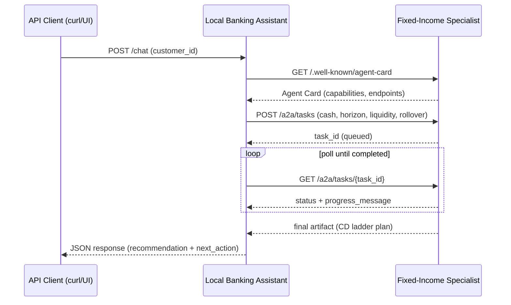

# Module 12 — Agent-to-Agent (A2A) CD Laddering

This folder implements the Lesson 12 A2A use case from the course:

- local banking assistant gathers saver profile + goals
- discovers a remote fixed-income specialist via Agent Card
- creates an A2A task for CD ladder planning
- polls task status until final ladder artifact is ready
- falls back to a local rule-based mini-ladder if the specialist is unavailable

## What is inside

- `main.py` — local assistant runner (`run_prompt`) used by shared API registry
- `a2a_protocol.py` — tiny A2A client helpers (discover card, create task, poll artifact)
- `specialist_api.py` — remote fixed-income specialist peer (`/.well-known/agent-card`, `/a2a/tasks`)
- `api_app.py` — standalone API wrapper for this module (`GET /health`, `POST /chat`)
- `run_a2a_api_server.sh` — starts Module 12 standalone API
- `run_a2a_specialist_server.sh` — starts remote specialist peer API
- `run_a2a_api.sh` — curl helper to invoke `POST /chat`

## Services to run (checklist)

| Service | Port (default) | Command | Needed for |
|--------|----------------|---------|------------|
| **Remote specialist** (A2A peer) | `8720` (override below) | `./a2a_agent/run_a2a_specialist_server.sh` | Real delegation from the local assistant. If this is down, `run_prompt` still returns JSON using the **local fallback** mini-ladder. |
| **Shared Agent API** | `8512` | `./run.sh` (starts API + React) or `uvicorn api_app:app --host 127.0.0.1 --port 8512` | **React UI** and `POST /api/chat` with `agent_key: a2a_agent`. |
| **React chat UI** | `8513` | Started by `./run.sh`, or `cd ui && npm run dev` | Browser chat; proxies `/api` to `8512` by default. |
| **Standalone Module 12 API** (optional) | `8726` (set `MODULE12_API_PORT` / `PORT` to change) | `./a2a_agent/run_a2a_api_server.sh` | **curl / scripts only** (`POST /chat` on this port). Not used by the React app. |

**Typical order for UI testing:** specialist (`8720`) → shared stack (`./run.sh` → API `8512` + UI `8513`).

Configure the specialist URL if it is not on localhost:8720:

```dotenv
MODULE12_A2A_SPECIALIST_URL=http://127.0.0.1:8720
```

(Put this in repo-root `.env` so the process that runs `a2a_agent.main` picks it up.)

**Change the specialist listen port:** `PORT=8830 ./a2a_agent/run_a2a_specialist_server.sh` or `MODULE12_SPECIALIST_PORT=8830 ./a2a_agent/run_a2a_specialist_server.sh`. If you change it, set `MODULE12_A2A_SPECIALIST_URL` to the same host/port (e.g. `http://127.0.0.1:8830`).

## Run the specialist (remote peer)

From repo root:

```bash
./a2a_agent/run_a2a_specialist_server.sh
```

Default URL:

- `http://127.0.0.1:8720`
- Agent Card: `GET /.well-known/agent-card`
- Create task: `POST /a2a/tasks`
- Poll task: `GET /a2a/tasks/{task_id}`

## Run Module 12 standalone API

In another terminal from repo root:

```bash
./a2a_agent/run_a2a_api_server.sh
```

Default URL:

- `http://127.0.0.1:8726`
- `GET /health`
- `POST /chat`

## Invoke with curl script

From repo root:

```bash
./a2a_agent/run_a2a_api.sh SAV-9001
./a2a_agent/run_a2a_api.sh SAV-7710
```

## Test from the React UI

The agent is registered in root `agents.json` as **`a2a_agent`** (title **A2A CD Ladder Agent**). The UI loads agents from `GET /api/agents` and sends prompts to `POST /api/chat`.

1. **Start the remote specialist** (recommended so you see full A2A delegation, not only fallback):

   ```bash
   ./a2a_agent/run_a2a_specialist_server.sh
   ```

2. **Start the shared API + React dev server** from the repo root:

   ```bash
   ./run.sh
   # optional — same behavior:
   ./run.sh start
   ```

   When things are healthy you should see the Agent API accept `/health`, then Vite report **Local: http://localhost:8513/** (Vite often prints `localhost` even though the API is on **http://127.0.0.1:8512** — that split is normal).

   - `./run.sh help` — usage and env hints (`LOG_LEVEL`, `VITE_DEV_HOST`).
   - **Expose the UI on your LAN** (Vite’s “Network” URL): from repo root run `VITE_DEV_HOST=0.0.0.0 ./run.sh` and ensure `AGENT_API_CORS_ORIGINS` in `.env` includes the origin you use in the browser (see `api_app.py`).

3. **Open the chat UI** in a browser: **http://localhost:8513/** (or **http://127.0.0.1:8513/** — use the exact URL Vite prints under `Local:`).

4. In the sidebar, select **A2A CD Ladder Agent**.

5. Send a saver customer id: **`SAV-9001`** or **`SAV-7710`**, or use the **Quick start** chips if shown.

6. The assistant reply is **pretty-printed JSON** (delegation summary, task timeline when the specialist is up, ladder `recommendation`, and `next_action`).

**Note:** Streamlit (`./runstreamlit.sh`) uses the same `agents.json` registry; you can pick **A2A CD Ladder Agent** there as well, but you must still run the **specialist** on `8720` (and point `MODULE12_A2A_SPECIALIST_URL` at it) for the remote path—the Streamlit app does not start the specialist for you.

## Raw curl example

```bash
curl -sS http://127.0.0.1:8726/chat \
  -H "Content-Type: application/json" \
  -d '{
    "prompt": "SAV-9001",
    "user_id": "curl-user"
  }'
```

## Environment variables

- `MODULE12_A2A_SPECIALIST_URL` — remote specialist base URL used by the local assistant (default `http://127.0.0.1:8720`)
- `MODULE12_SPECIALIST_PORT` — default port for `./a2a_agent/run_a2a_specialist_server.sh` when `PORT` is not set (default `8720`)
- `MODULE12_API_PORT` — default port for `./a2a_agent/run_a2a_api_server.sh` and for `API_BASE` in `./a2a_agent/run_a2a_api.sh` when `API_BASE` is not set (default `8726`)
- `VITE_DEV_HOST` — passed to Vite via `ui/vite.config.js`: set to `0.0.0.0` to listen on all interfaces when using `./run.sh`

## Sequence diagram



