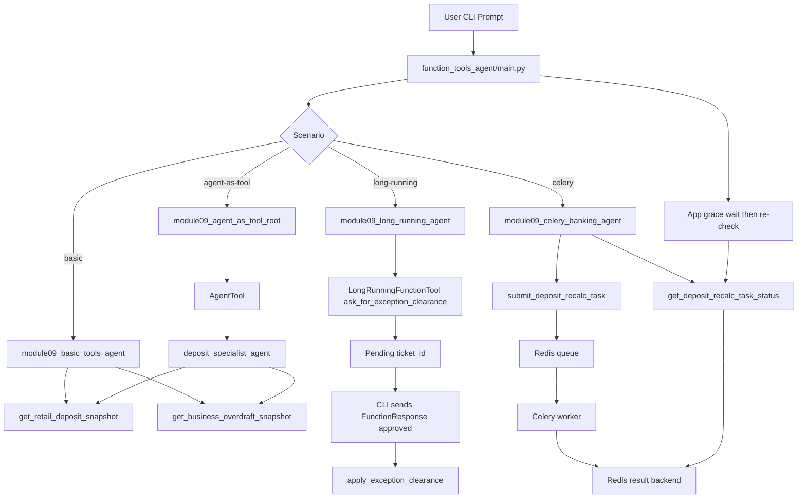

# Module 09: Function Tools Agent

This folder implements the **Module 09** lesson with runnable examples for:

1. **Function Tools** (plain Python functions in `tools=[...]`)
2. **Long Running Function Tools** (`LongRunningFunctionTool`)
3. **Agent-as-a-Tool** (`AgentTool`)
4. **Celery-backed async tool** (`celery` + Redis broker/backend)

It reuses the existing banking datasets from:

- `workflow_agent/workflow_tools.py` (Module 08 retail deposits)
- `multi_agent_banking/banking_tools.py` (Module 07 business banking)

---

## Files in this module

- `function_tools.py`
  - Banking-domain function tools used by this lesson.
  - Includes both normal tools and long-running flow helpers.
- `agent.py`
  - Builds three `LlmAgent` variants:
    - `create_basic_tools_agent()`
    - `create_long_running_tools_agent()`
    - `create_agent_as_tool_root_agent()`
    - `create_celery_banking_agent()`
- `main.py`
  - CLI runner with `--scenario basic|long-running|agent-as-tool|celery`.
  - Contains the two-turn resume simulation for long-running behavior.
- `celery_flow.md`
  - Mermaid sequence diagram + detailed code traversal for the Celery use case.

---

## What is implemented

## 1) Basic Function Tools

The basic scenario exposes plain Python functions directly as ADK tools.

- `get_retail_deposit_snapshot(customer_id)`
- `get_business_overdraft_snapshot(customer_id)`

The agent picks which tool to call based on customer ID shape (`RET-*` vs `CUST-*`) and returns concise markdown with facts and recommendations.

## 2) Long Running Function Tools

The long-running scenario uses:

- `LongRunningFunctionTool(ask_for_exception_clearance)`
- `apply_exception_clearance(...)` as completion tool

Flow:

1. Agent starts approval process (`status: pending`, `ticket_id` returned).
2. CLI simulates external approver response by sending `FunctionResponse`.
3. Agent finalizes via `apply_exception_clearance`.

This demonstrates the ADK long-running pattern in a safe CLI demo.

## 3) Agent-as-a-Tool

Two agents are used:

- `deposit_specialist_agent` (tool-enabled specialist)
- `module09_agent_as_tool_root` (coordinator)

The root delegates analysis to the specialist using:

- `AgentTool(agent=specialist, skip_summarization=True)`

So the user speaks to one root agent, but execution is performed by a delegated specialist.

## 4) Celery + Redis async banking tool

This scenario adds a tool-backed async pattern using Celery:

- `submit_deposit_recalc_task(customer_id)` -> enqueues `module09.recalc_deposit_score`
- `get_deposit_recalc_task_status(task_id)` -> checks state/result from Redis backend

Simple banking use case: **recalculate retail deposit stability score** asynchronously for a customer (`RET-*`), then report whether the score is complete or still pending.

Demo behavior (without `--poll-task`): if the first status check is still pending, the main app waits briefly and performs one follow-up status check so the final reply is less likely to stay in `PENDING`.

---

## Architecture diagram



---

## Usage

From repository root:

```bash
cd /Users/sathishkr/PycharmProjects/adk-masterclass
```

Run direct module commands:

```bash
# Basic function tools
./.venv/bin/python -m function_tools_agent.main --scenario basic RET-3101

# Long-running tool flow (2-turn demo with resume)
./.venv/bin/python -m function_tools_agent.main --scenario long-running \
  "Request manual approval for RET-4420 due to source-of-funds check"

# Agent-as-a-tool delegation
./.venv/bin/python -m function_tools_agent.main --scenario agent-as-tool CUST-1001

# Celery-backed async banking tool
./.venv/bin/python -m function_tools_agent.main --scenario celery RET-3101

# Show raw tool responses (includes task_id), then model summary
./.venv/bin/python -m function_tools_agent.main --scenario celery --show-tool-events RET-3101

# Auto-poll task until completion/timeout
./.venv/bin/python -m function_tools_agent.main --scenario celery --show-tool-events --poll-task RET-3101

# Without polling: wait 4 seconds before one follow-up status check
./.venv/bin/python -m function_tools_agent.main --scenario celery --status-grace-seconds 4 RET-3101
```

Run helper script:

```bash
./run_function_tools.sh
./run_function_tools.sh basic RET-3101
./run_function_tools.sh long-running
./run_function_tools.sh agent-as-tool CUST-1001
./run_function_tools.sh celery RET-3101
```

### Track celery completion status

The easiest way is to enable tool event output and polling:

```bash
./.venv/bin/python -m function_tools_agent.main --scenario celery --show-tool-events --poll-task RET-3101
```

- `--show-tool-events` prints the raw submit payload with `task_id`.
- `--poll-task` polls `get_deposit_recalc_task_status(task_id)` until `ready=true` or timeout.
- Without `--poll-task`, app does a one-time grace wait + follow-up check when first status is pending.
- Optional tuning:
  - `--poll-interval 1.0`
  - `--poll-timeout 60`
  - `--status-grace-seconds 3`

---

## Tool list in this module

- **Normal function tools**
  - `get_retail_deposit_snapshot`
  - `get_business_overdraft_snapshot`
  - `apply_exception_clearance`
- **Long-running starter**
  - `ask_for_exception_clearance` (wrapped by `LongRunningFunctionTool`)
- **Delegation wrapper**
  - `AgentTool` wrapping `deposit_specialist_agent`
- **Celery-backed async tools**
  - `submit_deposit_recalc_task`
  - `get_deposit_recalc_task_status`

---

## Notes

- This lesson is currently **CLI-focused** (not wired into `agents.json`).
- The long-running example is deterministic and local; no external approval service is required.
- Tool outputs are structured dictionaries so LLM calls stay grounded in explicit numeric facts.

---

## Celery setup (for `celery` scenario)

Install Celery with Redis support:

```bash
cd /Users/sathishkr/PycharmProjects/adk-masterclass
./.venv/bin/pip install "celery[redis]"
```

### Option A: local Redis (quick start)

Run Redis locally (example with Docker):

```bash
docker run --rm -p 6379:6379 redis:7
```

Start Celery worker (new terminal):

```bash
cd /Users/sathishkr/PycharmProjects/adk-masterclass
./.venv/bin/celery -A function_tools_agent.function_tools:celery_app worker -Q module09_banking_tasks -l info
```

Then run the scenario:

```bash
./.venv/bin/python -m function_tools_agent.main --scenario celery RET-3101
```

### Option B: existing remote Redis (different IP/port)

Set Redis connection in `.env` (or environment variables) before starting the worker:

```dotenv
# Preferred: full URL (supports remote host + password + custom port)
MODULE09_CELERY_REDIS_URL=redis://:your-password@10.20.30.40:6380/0

# Alternative (used only when MODULE09_CELERY_REDIS_URL is not set):
MODULE09_REDIS_HOST=10.20.30.40
MODULE09_REDIS_PORT=6380
MODULE09_REDIS_DB=0
MODULE09_REDIS_PASSWORD=your-password
```

Then run worker + scenario as usual:

```bash
./.venv/bin/celery -A function_tools_agent.function_tools:celery_app worker -Q module09_banking_tasks -l info
./.venv/bin/python -m function_tools_agent.main --scenario celery RET-3101
```

If you see `Received unregistered task of type 'module09.recalc_deposit_score'`, restart the worker after pulling code changes so the task registration is loaded from module import.

`function_tools_agent/function_tools.py` loads `.env` automatically, so this works even when you start Celery directly from CLI.

If Celery or Redis is unavailable, the tools return setup guidance instead of crashing.
