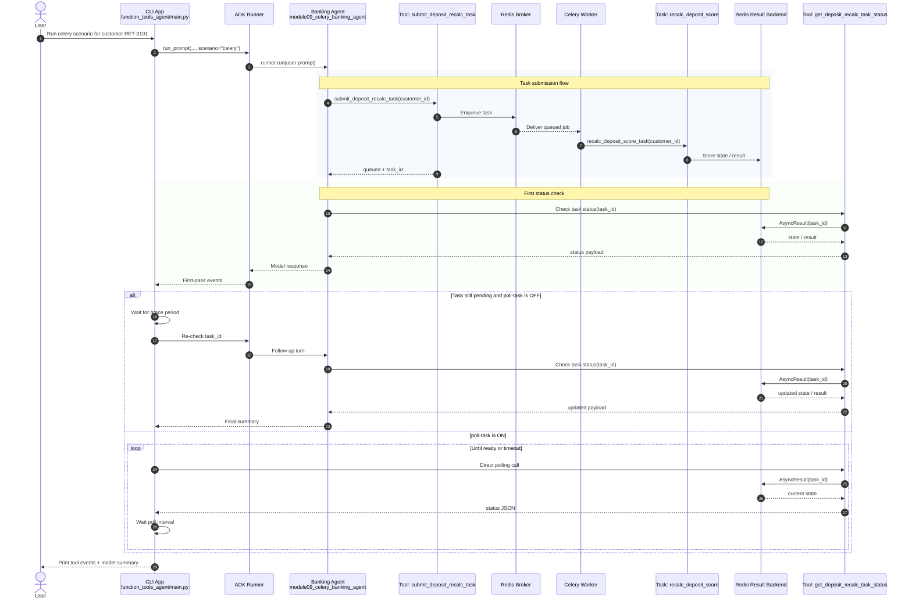
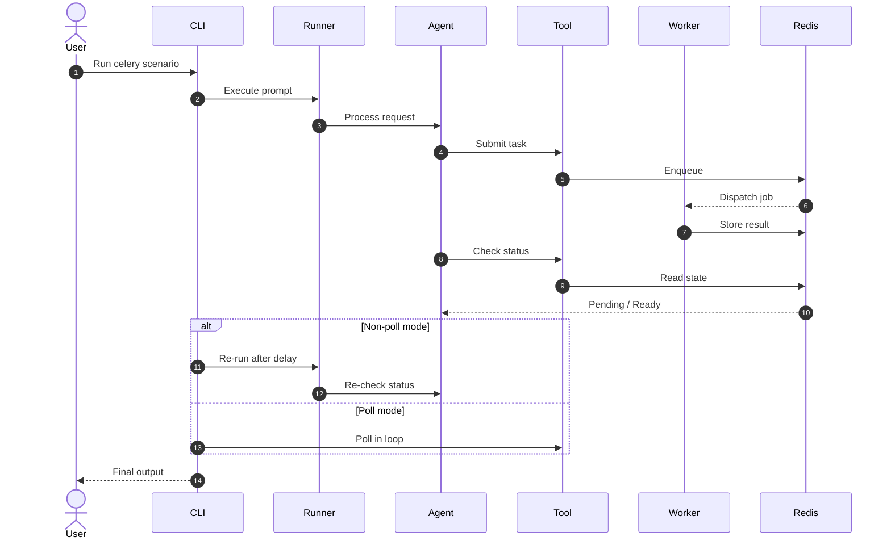

# Module 09 Celery Flow: CLI -> Agent -> Celery -> Result

This note explains the exact runtime traversal for the Module 09 Celery scenario.

## Sequence Diagram



## Code Traversal (File/Function Level)

Call chain for `celery` scenario:

`main()` → `run_prompt(prompt, scenario="celery", …)` → `_runner_for("celery")` → `_run_celery(runner, prompt, user_id, session_id, …)`.

### What is `prompt` at each step?

| Step | Location | Value |
|------|----------|--------|
| CLI | `argparse` positional `prompt` | Whatever you pass (e.g. `RET-3101`). If omitted, **default** `"RET-3101"` (`main.py`). |
| Into `run_prompt` | `run_prompt(args.prompt, …)` | Same string as above. |
| First `runner.run` | `_run_celery` line ~193: `new_message=_user_message(prompt)` | **Same** user-facing prompt (e.g. `"RET-3101"` or a longer sentence that still lets the model extract the customer id). |
| Second `runner.run` (grace re-check only) | `_run_celery` line ~232: `new_message=_user_message(follow_up)` | **Different** string — **not** the original CLI prompt. Built as: `Re-check the async task status for task_id {task_id} now and share the latest state/result.` Only used when first status is still pending-like, `--poll-task` is OFF, and `status_grace_seconds > 0`. |

1. CLI entry:
   - `function_tools_agent/main.py` -> `main()`
   - Parses positional `prompt` (default `"RET-3101"`) and flags: `--scenario`, `--show-tool-events`, `--poll-task`, `--status-grace-seconds`, etc.
   - Calls `run_prompt(args.prompt, scenario=args.scenario, …)`.

2. Scenario routing:
   - `run_prompt(prompt, …)` builds `runner = _runner_for(scenario)` once.
   - For `scenario == "celery"`, calls `_run_celery(runner, prompt, user_id, session_id, …)` — **`prompt` is forwarded unchanged** from the CLI.

3. Runner and agent construction:
   - `_runner_for("celery")` → `create_celery_banking_agent(settings)` in `agent.py`, wrapped in ADK `Runner` (`main.py` `_runner_for`).

4. Agent definition:
   - `function_tools_agent/agent.py` -> `create_celery_banking_agent(...)`
   - Agent tools: `submit_deposit_recalc_task`, `get_deposit_recalc_task_status`.

5. Submit async work:
   - `function_tools_agent/function_tools.py` -> `submit_deposit_recalc_task(customer_id)`
   - Calls `recalc_deposit_score_task.delay(normalized_customer_id)`.
   - Returns sync payload: `status=queued`, `task_id`.

6. Worker execution:
   - Celery worker process loads `celery_app` and task:
     - `@celery_app.task(name="module09.recalc_deposit_score")`
   - Runs `recalc_deposit_score_task(...)` -> `_compute_deposit_recalc_payload(...)`.
   - Celery stores task state and final result in Redis backend.

7. First status check by agent:
   - Agent calls `get_deposit_recalc_task_status(task_id)`.
   - Tool reads `app.AsyncResult(task_id)` and returns `state`, `ready`, `successful`, and `result/error` when ready.

8. App-side grace re-check (non-poll mode):
   - In `_run_celery(...)`, if first status is pending/progress-like and `--poll-task` is OFF:
     - sleep `status_grace_seconds` (default `3.0`)
     - second `runner.run` uses `follow_up` (see table above), **not** the original CLI `prompt`.
   - This reduces immediate `PENDING` final summaries for demos.

9. Poll mode (optional):
   - If `--poll-task` is ON, `_run_celery(...)` directly polls
     `get_deposit_recalc_task_status(task_id)` in a loop until ready/timeout.

10. Final output to terminal:
   - `_extract_last_text(events)` captures final model text.
   - CLI prints scenario header + optional raw tool payloads + model summary.

## Flow Chart

``` mermaid

flowchart TD
    A[CLI: main.py] --> B[Parse Flags<br/>scenario, poll-task, grace-seconds]

    B --> C{Scenario == celery?}
    C -->|Yes| D[run_prompt → _run_celery]
    D --> E[Build ADK Runner]
    E --> F[Create Banking Agent<br/>with tools]

    F --> G[Submit Task<br/>submit_deposit_recalc_task]
    G --> H[Celery Broker (Redis)]
    H --> I[Celery Worker]
    I --> J[recalc_deposit_score_task]
    J --> K[Store Result in Redis]

    F --> L[First Status Check<br/>get_deposit_recalc_task_status]
    L --> M{Task Ready?}

    M -->|Yes| N[Return Final Result]

    M -->|No| O{Poll Mode?}

    O -->|OFF| P[Sleep (grace seconds)]
    P --> Q[Re-run Agent]
    Q --> R[Second Status Check]
    R --> N

    O -->|ON| S[Loop Poll Status]
    S --> T{Ready / Timeout}
    T -->|Ready| N
    T -->|Timeout| U[Return Partial Status]

    N --> V[CLI Output<br/>Events + Summary]

```



## Practical Notes

- Agent instruction stays generic; orchestration timing is controlled by CLI/app.
- Worker should stay free of demo sleep for realistic queue behavior.
- Use `--poll-task` for deterministic completion demos; use `--status-grace-seconds` for a lighter one-time follow-up.
